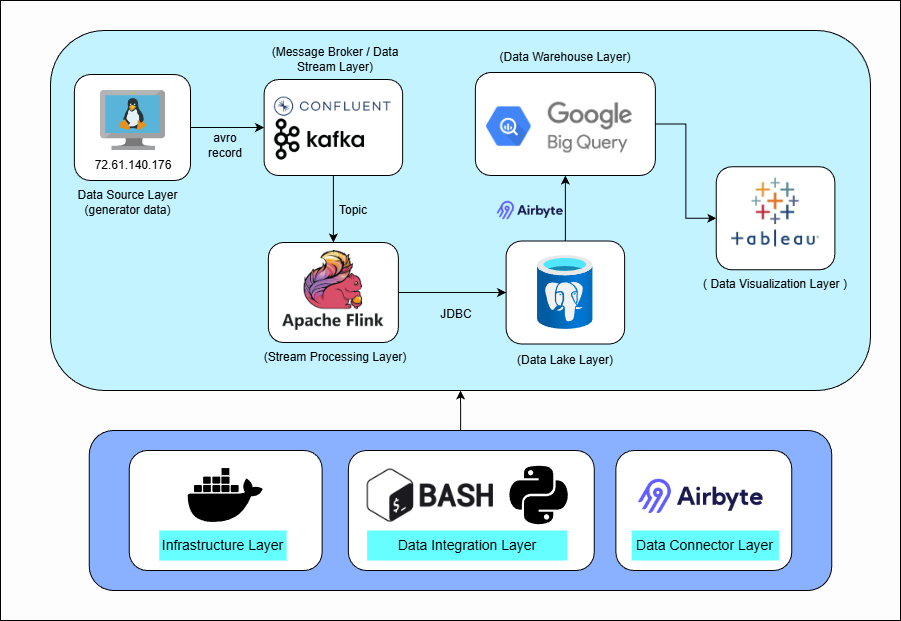
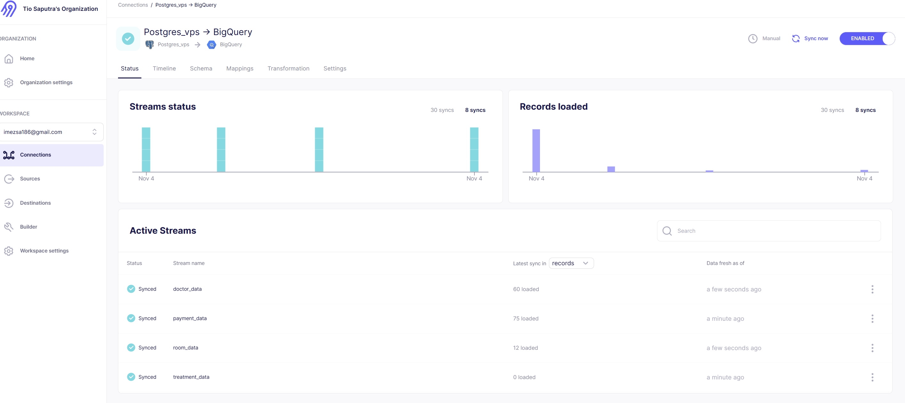
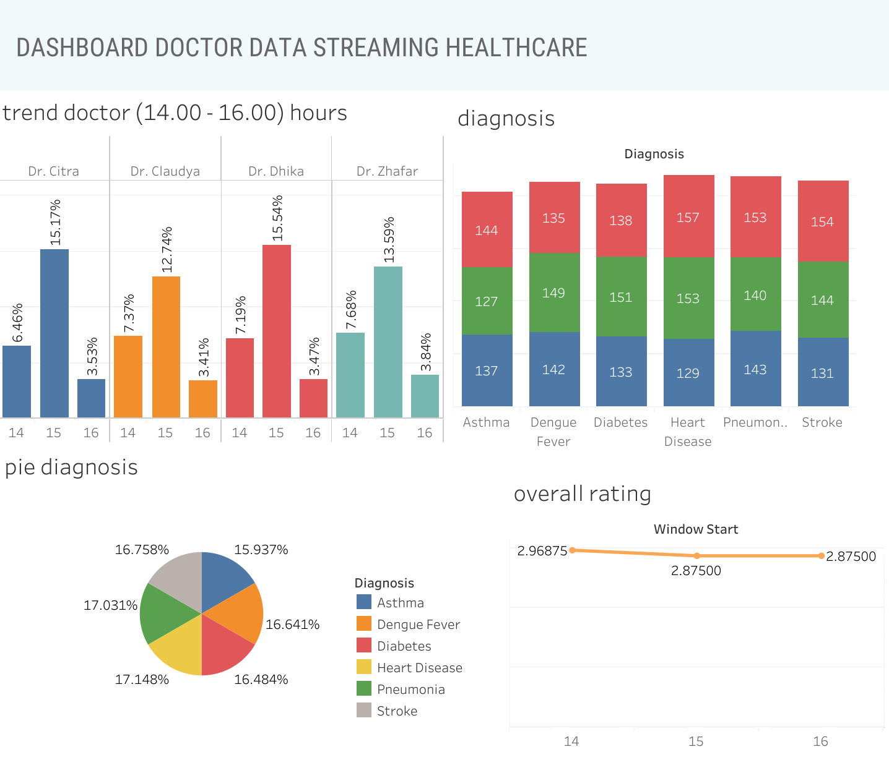
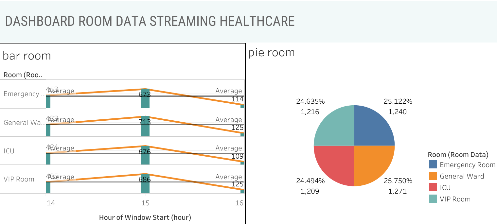
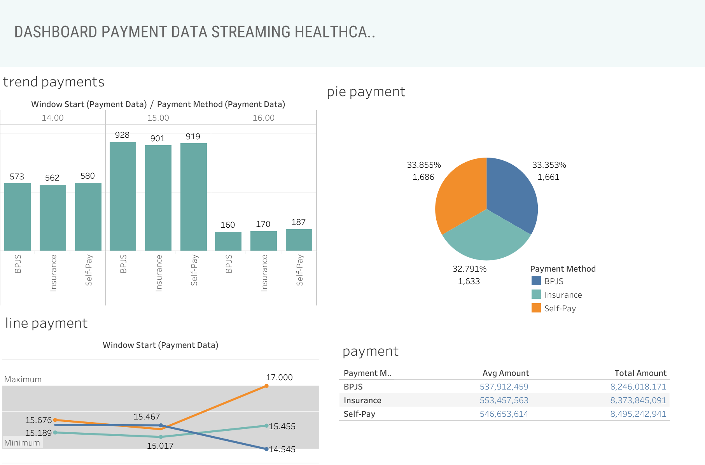

> Proyek ini membangun end-to-end data pipeline untuk mengelola streaming data secara real-time — mulai dari data generator hingga visualisasi bisnis menggunakan Tableau. Seluruh sistem dijalankan di dalam Virtual Machine (VM) agar lingkungan terisolasi, stabil, dan mudah dikonfigurasi ulang.

## Environment
Pipeline dijalankan di **Virtual Machine (VM)** dengan spesifikasi:
- OS: Debian 13 
- specifications : 2v CPU cores, 8GB Ram
- Containerization: Docker & Docker Compose  

## End-to-End Data Architecture

- **Data Source Layer:** Menghasilkan data dummy(faker) menggunakan `producer.py` dan mengirimnya dalam format **Avro record**.  
- **Message Broker / Data Stream Layer:** **Confluent Kafka** menampung dan mendistribusikan data melalui **Topic** ke sistem downstream.  
- **Stream Processing Layer:** **Apache Flink** memproses stream data dari Kafka secara real-time dan menyimpannya ke **PostgreSQL** melalui **JDBC**.  
- **Data Lake Layer:** **PostgreSQL** menyimpan hasil pemrosesan data sebagai sumber utama untuk integrasi lebih lanjut.  
- **Data Visualization Layer:** **Tableau** digunakan untuk membuat dashboard interaktif dari data yang tersimpan di BigQuery.  
- **Data Integration Layer:** **Python** dan **Bash** script digunakan untuk otomasi dan pengelolaan pipeline.  
- **Infrastructure Layer:** **Docker** mengelola seluruh service agar berjalan konsisten di dalam VM.  
- **Data Connector Layer:** **Airbyte** mengatur koneksi dan sinkronisasi antar sistem data dari PostgreSQL ke **Google BigQuery**.

## Data Integration with Airbyte

Proses integrasi data dari **Data Lake** ke **Data Warehouse** dilakukan menggunakan **Airbyte**.  
Airbyte berperan sebagai *data movement tool* yang menghubungkan berbagai sumber data dan memindahkannya secara otomatis melalui konektor bawaan.

>  Dalam pipeline ini, Airbyte digunakan untuk menyalin data dari **PostgreSQL (Data Lake)** ke **Google BigQuery (Data Warehouse)** secara terjadwal dan terkontrol.

## Dashboard
> Terdapat 3 analisa interaktif untuk operasional rumah sakit.

### Doctor Performance

> Dashboard ini memonitring kinerja dokter: jumlah pasien, rata‑rata rating, dan distribusi outcome.

### Room Occupancy

> Dashboard ini memonitring okupansi per ruangan dan puncak jam untuk optimasi penjadwalan.

### Patients Payments

> Dashboard ini memonitring volume & nilai transaksi per metode pembayaran serta deteksi anomali.

# step by step data stream
>Langkah-langkah untuk menjalankan pipeline **Data Stream** menggunakan Docker & Apache Flink
- download JDBC Drivers di [confluent-hub](https://www.confluent.io/hub/)
- Letakkan semua file `.jar` ke dalam folder:jars
- semua library `faker` dan `confluent-kafka` telah ter-install di lokal maupun VM
- Build image untuk datastream:
    -       docker build -t stream:latest .
- Jika pipeline dijalankan secara local (bukan di VM), ubah IP dari VM menjadi localhost.Kemudian berikan akses ke folder jars agar dapat di-mount ke container:
    -       chmod -R 777 /root/datastream/jars
- jalankan seluruh container docker:
    -       docker compose up -d
- jalankan producer:
    -       python producer.py
- masuk kedalam container jobmanager untuk menjalankan flink job:
    -       docker exec -it flink-jobmanager bash
- Eksekusi job Python di dalam container Flink:
    -       flink run -py /opt/pyjobs/*job.py(lakukan satu per satu)

